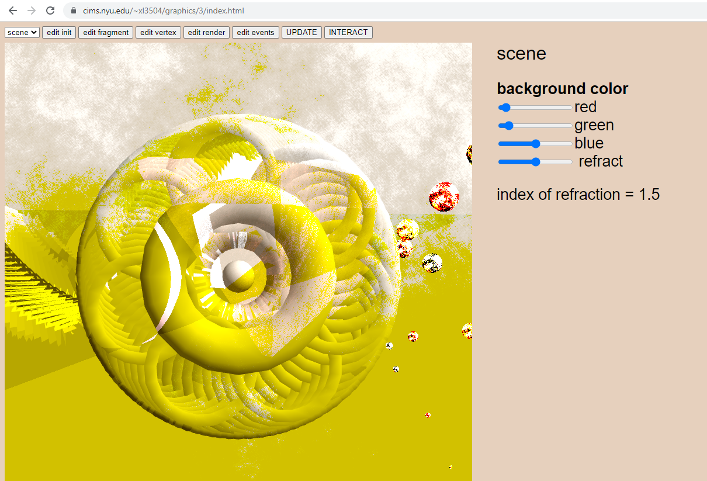
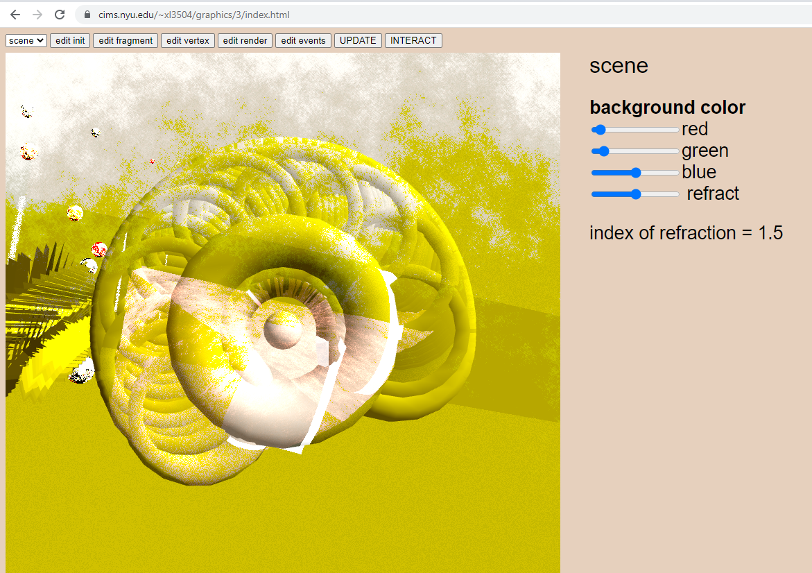
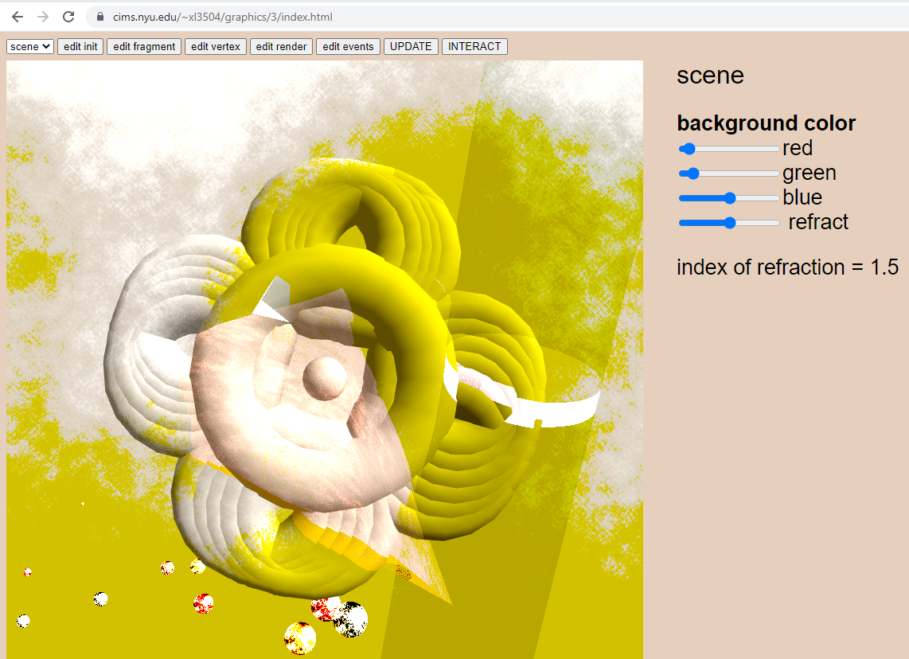
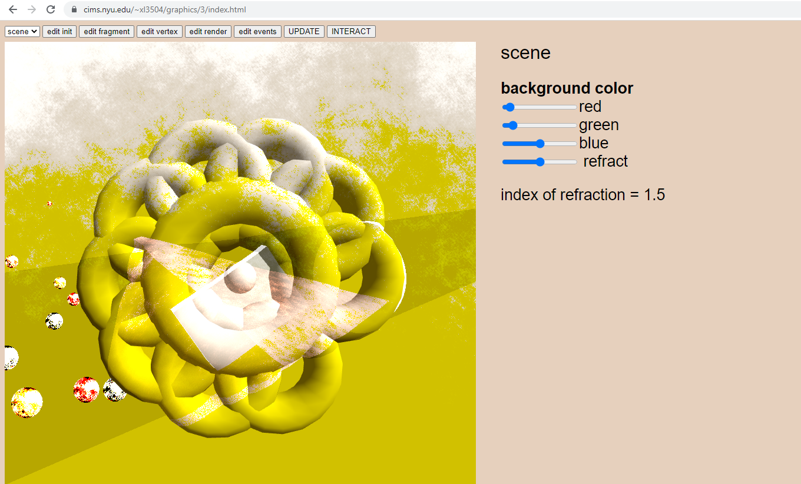
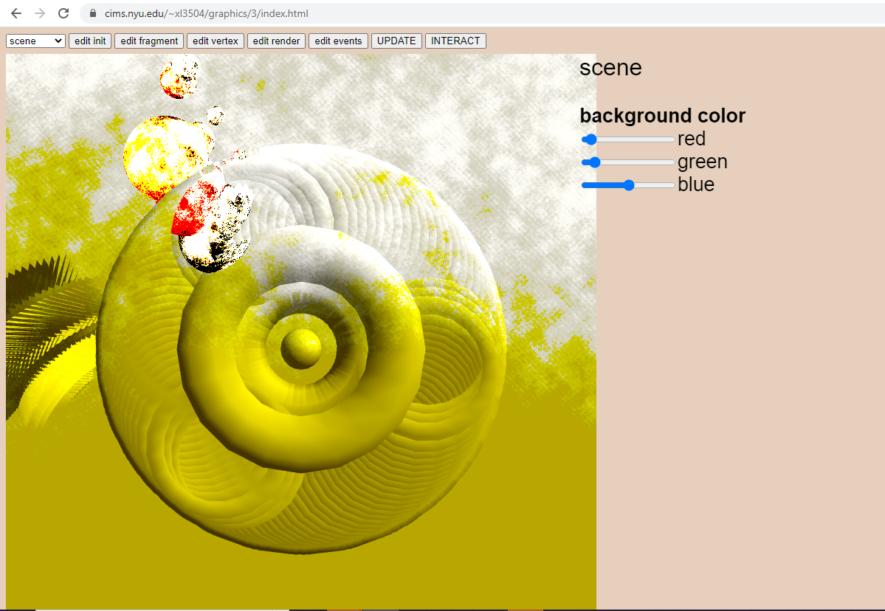

# mesh
Xi Liu 
2022 
meshes are represented by triangle strips 
glue_mesh(float * a, float * b) concatenates the last vertex of a with first vertex of b, uv_mesh(float * (*f)(float, float), float nu, float nv) 
each vertex contains position, surface normal, and uv coordinates 
ray trace to second order surfaces such as cylinder, hyperboloid 
ray trace to halfspace surfaces, using different random number generators to generate polygon arrays that contain homogeneous form of halfspace descriptions of polygons 

